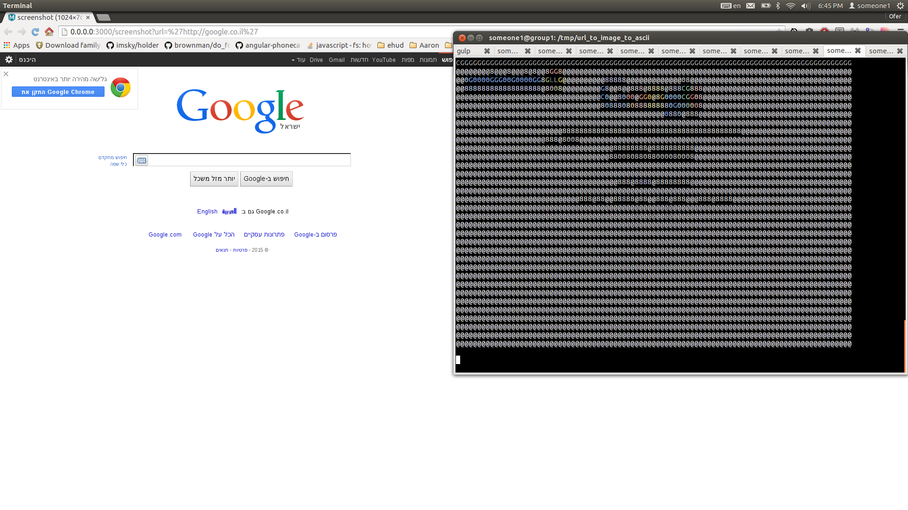

convert: url -> image -> ascii
============

**Utilize 2 npm modules:**
 1. convert a url to image 
 2. convert an image to ascii

system dependencies:
---
- graphicsmagick

why ?
---
- assume the need of image-to-url conversion
- by printing the image to the console we can debug the first step
